# Replicating: "Prequal: Load is not what you should balance: Introducing Prequal"

**Team Members:**  
Hannah Goldstein (hannah.barbosa@mail.polimi.it);  
Nico Koron (nicolas.koron@mail.polimi.it);  
Celestino Garrós (celestino.garros@mail.polimi.it)

---

**Source Paper:**
Bartek Wydrowski, Robert Kleinberg, Stephen M. Rumble, Aaron Archer: Load is not what you should balance: Introducing Prequal. In Proceedings of the 21st USENIX Symposium on Networked Systems Design and Implementation (NSDI '24), USENIX Association, 2024.


**Project:**
https://github.com/cgarros33/loadbalancer
(forked from https://github.com/omarshaarawi/loadbalancer)

---

# 1. Introduction

Large-scale online services route each incoming query to one of many interchangeable
replicas of a backend service. The choice of replica has a direct effect on tail
latency and error rates: a query sent to an overloaded or otherwise degraded replica
can take orders of magnitude longer than the same query sent to a healthy one. The
paper argues that the metrics conventionally used to make this choice — CPU
utilization, server-reported "load", or simple request-in-flight counts on their
own — correlate poorly with the latency a query will actually experience, because
replicas in a real datacenter are heterogeneous: different hardware generations,
co-located "antagonist" jobs competing for CPU/cache/network, and request-cost
variance all change a replica's effective capacity in ways that are not visible to
the client choosing where to send the next query.

Prequal's approach is to have each client directly **probe** a random sample of
replicas for two real-time signals — **R**equests-**I**n-**F**light (RIF) and a
recent **observed latency** — and maintain a small, continuously refreshed **probe
pool** of these responses. When a query arrives, the client picks a replica from the
pool using the **HCL** (Hot/Cold-Latency) rule: replicas whose RIF exceeds a
threshold (`QRIF`) are classified "hot"; among "cold" replicas the client picks the
one with the lowest recent latency, falling back to a latency-based choice among hot
replicas only if the whole pool is hot. The probing rate and pool size are tunable
parameters with a clear cost/benefit trade-off, which the paper studies explicitly.

The main contributions are: (1) the probe-pool maintenance protocol (bounded size,
age-based eviction, configurable probing rate); (2) the HCL replica-selection rule
combining RIF and latency signals; and (3) a large-scale evaluation — including a
production deployment at Google — showing that Prequal reduces tail latency and
error rates relative to simpler baselines (Round Robin, Least-Loaded, Power-of-Two-
Choices, C3, etc.).

# 2. Selected Result

We reproduce two analyses centered on Prequal's two tunable knobs — **probing rate**
and **probe pool size** — comparing our implementation of the HCL selection rule
("Prequal") against Round Robin ("RR") as the baseline.

- **Experiment A** replicates **Figure 8**: the probe-rate sweep. The probe pool
  size is held fixed (P=16, the paper's default for a 100-backend fleet) and the
  probe rate is varied as a multiple of the query rate, under a workload designed to
  push the system toward the paper's stated worst case of "roughly 1.5x our CPU
  allocation". The paper's headline claim is:

  > "Prequal is fairly insensitive to the probing rate until we drop below one probe
  > per query, at which point the negative effects become significant... the tail
  > RIF distributions jump visibly, and this is echoed by both latency quantiles."

- **Experiment B** sweeps the **probe pool size** P at a fixed probe rate (4x query
  rate, the paper's default for the pool-size experiment), exploring the pool-size
  trade-off the paper discusses in Section 5 (default pool size 16, capped, with the
  explicit assumption that "each client's probe pool represents only a small random
  subset of replicas").

For both experiments we measure end-to-end p99/p99.9 request latency and the
selected replica's RIF percentiles (p50/p75/p99). Results are presented at fleet
sizes of 10, 50 and 100 backends (Docker, Section 4.3–4.4) and at 100 backends on
dedicated CloudLab hardware (Section 4.6).

**Headline result (Docker, 50 backends)**: Prequal's p99 is **439–657 ms** vs.
Round Robin's **688–840 ms** across the full probe-rate sweep (30–40% reduction),
with errors appearing only at probe rates ≤ 1x — consistent with the paper's Figure
8 threshold. Experiment B shows Prequal's p99 improving from **1020 ms** (P=1) to
**450 ms** (P=8), then plateauing — the knee at P=8 corresponds to 16% of the
50-backend fleet. At 100 backends (CloudLab, 3 runs, Section 4.6.2) the effective knee falls at P=8
(8% of fleet), with the curve essentially flat from P=8–32 and further slow
improvement to P=48, confirming that the **pool-to-fleet ratio** governs where the
knee falls, not the absolute pool size.

**Headline result (CloudLab, 100 backends, 3 runs each)**: on dedicated hardware
(Section 3.2), the same qualitative patterns hold with much sharper magnitudes.
Prequal's p99 at full probe rate (4x) is **999 ms** vs. RR's **3616 ms** — a
**3.6x** advantage — and degrades gradually to **3233 ms** at 0.5x probe rate,
converging with RR as expected. Prequal errors are strictly zero at ≥ 2x probe rate
and climb sharply below 1x (avg 140 errors at 0.71x, 359 at 0.5x). Experiment B
shows the large P=1→2 jump (3721 ms → 1432 ms) with continued improvement through
P=48 (881 ms), consistent with P=48 being only 48% of the fleet.

# 3. Environment Setup

## 3.1 Docker Environment (Local Runs)

**Hardware Environment:**
A single Windows host running Docker Desktop on WSL2 (kernel
`5.15.167.4-microsoft-standard-WSL2`), 12 vCPUs, 15GB RAM. All services (load
balancer, backends, load generator, Prometheus/Grafana) run as containers on a
single Docker Compose network on this one host — there is no real network between
"replicas" as in the paper's datacenter deployment.

**Software Environment:**
Go 1.24 (module), built with the go1.26.3 toolchain; Docker 28.1.1 / Docker Compose
v2.35.1. No public artifact from the paper was available — the load balancer, HCL
selection rule, probe pool, and a synthetic antagonist-load backend are all
reimplemented from scratch in this repository (git commit `080c7bf`).

**Backend Simulator Model:**
Each backend simulates a bounded-queue server via a Go channel semaphore of size
`capacity=10` (concurrency slots). An antagonist process periodically steals some
of those slots by slowing service time proportionally:

```
effectiveC       = capacity - capacity * antagonistPct / 100
effectiveService = base_service_ms * capacity / effectiveC
saturationQPS    = effectiveC * 1000 / base_service_ms
queueDepth       = saturationQPS * 20
```

Service time is sampled with multiplicative Gaussian jitter (σ = mean, matching
the paper's cost distribution — "variance equal to mean"). A backend returns HTTP
503 when its current RIF exceeds `queueDepth`. At the worst antagonist state
(80%): `effectiveC=2`, `effectiveService=300 ms`, `saturationQPS≈33`, `rho=50/33≈1.5`
— the paper's stated ceiling of "1.5x our CPU allocation."

**Load Generator:**
The load generator issues requests on a fixed-rate ticker (one request every
`1/QPS` seconds), regardless of outstanding responses — an open-loop deterministic
arrival process matching the paper's stated load model. The client timeout is 5 s.
Errors are counted as any non-2xx response or connection failure.

**Configuration Parameters:**

Common to both experiments:
- `capacity=10`, `base-service-ms=60` → `C_throughput = 166.7` QPS/backend.
- Query load `QPS = 50 × backends` (≈30% of `C_throughput` per backend at the
  antagonist floor; ≈1.5x at the antagonist ceiling).
- Per-backend **antagonist** process: a 5-state random walk over
  `{20, 35, 50, 65, 80}%` of `capacity`, mean dwell time 2000 ms. Backends are split
  into three groups — hot-bias=0.50, neutral-bias=0.425, cold-bias=0.3 — so the
  worst state (80%) is visited ≈20% of the time for hot backends, ≈10% neutral,
  ≈2% cold.
- `QRIF=0.84`: the HCL hot/cold threshold is set to the **84th percentile** of the
  pool's current RIF values (the paper's default is 0.70; see Deviations below). With
  the paper's default pool size P=16 (used in CloudLab runs and Docker Experiment B),
  this means `sorted_rif[13]` is the threshold — the top 2–3 entries are "hot" and
  the bottom 13–14 are "cold" (preferred). Docker Experiment A used P=8, where
  `sorted_rif[6]` is the threshold (top 2 hot, bottom 6 cold).

Experiment-specific (Docker runs):
- **A**: `ProbePoolSize=8` fixed; `ProbeRateMultiplier ∈ {4, 2√2, 2, √2, 1, 1/√2,
  0.5}`; 30 s measurement window, no warmup/drain.
- **B**: `ProbeRateMultiplier=4.0` fixed; `ProbePoolSize ∈ {1, 2, 4, 8, 16, 24, 32}`;
  30 s measurement, 15 s warmup, 5 s drain.

**Deviations from the Original Setup:**

- **Scale.** The paper evaluates production fleets with hundreds of replicas; our
  local hardware (12 cores) limits us to 10/50/100-backend fleets. Since
  `CPUsPerBackend=1.0` is fixed regardless of fleet size, 10/50/100 backends
  correspond to 0.83x/4.2x/8.3x CPU oversubscription on the host — an additional,
  unintended source of contention on top of the antagonist model, most severe at
  100 backends (see Sections 4.3 and 5).
- **Round Robin probes in our implementation.** In the paper, RR is a pure
  client-local baseline that never probes. In our implementation, RR shares the same
  background probing infrastructure as Prequal (`fireProbes()` / `probeOne()` run
  unconditionally for both algorithms) — RR uses only the resulting health-check
  signal (`IsHealthy`), not the RIF pool. We kept this because it is a controlled-
  comparison design choice (both algorithms see identical background probe traffic
  and server health state), and because RR's error-rate sensitivity to probe rate
  turned out to be a useful diagnostic (Section 4.5).
- **Load model.** The paper does not specify the exact workload/contention
  generator used for Figure 8. We designed our own 5-state antagonist random walk
  (above), calibrated so the system's steady state matches the paper's stated
  "~1.5x allocation, worst case" only during occasional ceiling excursions, rather
  than as a permanent condition (an earlier, harsher calibration made *every* step
  collapse to 40–68% errors — see comments in `scripts/run_experiment_a.sh`).
- **QRIF.** The paper's default `QRIF=0.70` (70th-percentile RIF threshold). Our
  implementation uses `QRIF=0.84`, which classifies fewer backends as "hot" and
  widens the cold-preferred set. A higher QRIF makes Prequal less selective: more
  backends pass the cold filter, slightly reducing routing benefit but also preventing
  excessive concentration on the few lowest-RIF backends. We chose 0.84 empirically
  during calibration; the qualitative behavior (probe-rate sensitivity threshold,
  pool-size curve shape) is unchanged.


## 3.2 CloudLab Environment

To obtain cleaner results at 100 backends — free of the Docker CPU-oversubscription
confound — we re-ran Experiments A and B on a dedicated 11-node cluster allocated
on CloudLab (Utah cluster, HP ProLiant nodes).

**Topology:**
- 1 LB node (`hp143.utah.cloudlab.us`): runs the load balancer (two processes:
  Prequal on port 8080, RR on port 8081) and the experiment/loadgen binary.
- 10 backend nodes (`hp147`, `hp151`, `hp123`, `hp139`, `hp138`, `hp130`, `hp154`,
  `hp132`, `hp159`, `hp125`): each runs 10 backend processes on ports 8080–8089,
  for a total fleet of **100 backends**.

**Deployment:**
Go binaries are cross-compiled on the local WSL2 host (`GOOS=linux GOARCH=amd64`)
and deployed via `rsync`/`scp` over SSH. Backends and the LB are started as plain
OS processes (no Docker). The experiment binary uses a `/reconfigure` HTTP endpoint
on the LB to change `ProbePoolSize`/`ProbeRateMultiplier` between sweep steps
without restarting, keeping backends warm across the entire run.

**Configuration (CloudLab runs):**
- `capacity=5`, `base-service-ms=150` → cold-floor (20%-antagonist) saturation QPS
  ≈ 27 QPS/backend (effectiveC=4); 80%-antagonist saturation QPS ≈ 6.7 QPS/backend
  (effectiveC=1, effectiveService=750 ms).
- `QPS=1130` total (≈11.3 QPS/backend), giving ρ ≈ 0.42 at the cold floor and
  ρ ≈ 1.7 at the 80%-antagonist ceiling — bracketing the paper's "~1.5x allocation"
  worst case. QPS was tuned so the probe-detection time at 1x probe rate places the
  Prequal/RR crossover near the 1x mark.
- `ProbePoolSize=16` fixed for Experiment A; `ProbeRateMultiplier=4.0` fixed for
  Experiment B; pool sizes `{1,2,4,8,16,24,32,40,48}` for Experiment B.
- `QRIF=0.84`, same antagonist walk parameters as Docker runs (5 states
  `{20,35,50,65,80}%`, mean dwell 2000 ms, hot/neutral/cold-bias 0.50/0.425/0.30).
- Each experiment repeated **3 independent runs**; tables below show the mean p99.

# 4. Experiment Result

## 4.1 Execution and Measurement

`cmd/experiment` orchestrates each run: for every (algorithm, sweep-step)
combination it regenerates `docker-compose.yml` via `compose-gen` with that step's
`ProbePoolSize`/`ProbeRateMultiplier`, brings up an isolated stack (one LB + N
backends + Prometheus/Grafana), runs the containerized load generator
(`docker compose --profile tools run loadgen`) for the configured
duration (+ warmup + drain), and records: end-to-end p50/p99/p99.9 latency and error
count from the load generator, plus the selected replica's RIF p50/p75/p99 scraped
from the LB's Prometheus metrics. Each row of the result CSVs is **one 30-second run**. Docker runs have a single
trial per data point; CloudLab runs were repeated 3 times each and tables report
mean p99 (see Section 4.6).

To check correctness we verified `total_requests` against the expected `QPS ×
duration`, confirmed RIF percentiles moved in the expected direction with probe pool
size/rate, and used the Grafana dashboards during development to confirm backend
CPU/queue behavior matched the configured antagonist model.

## 4.2 Debugging Notes

- **Host-port relay artifact.** Early runs pointed the load generator at
  `localhost:<published-port>`. On Docker Desktop/WSL2 this traffic crosses a slow
  host↔VM relay that itself becomes the bottleneck, producing ≈100% error rates that
  reflected the relay, not the LB. Fix: always run the load generator as a container
  on the compose network (`-url http://lb-prequal:8080`); we also added a runtime
  warning for loopback URLs (`cmd/loadgen/main.go`, `warnIfLoopback`).
- **Probe-worker pool sizing.** At 50-backend/2500-QPS scale, the original
  `probeWorkers`/`probeQueueSize = 50/100` (sized for the 10-backend/500-QPS
  baseline) was too small: probes were dropped under load, the pool went stale, and
  both algorithms occasionally routed into already-overloaded backends (0.4–3.5%
  errors, `results_b_v1.csv`). Scaling 3x to `probeWorkers=150, probeQueueSize=300`
  eliminated these errors with unchanged latency trends (`results_b_50be.csv`). We
  also tried `400/800` for the 100-backend runs; this *increased* total errors
  (8181–29576 vs 2615 at 150/300), so `150/300` was kept as the validated setting at
  all scales.
- **Docker build concurrency.** Building all 100 backend images in parallel
  occasionally failed with buildkit `"no such job"` errors; resolved by capping
  build concurrency with `COMPOSE_PARALLEL_LIMIT=8`.

## 4.3 Experiment A — Probe-Rate Sweep (Figure 8 replica)

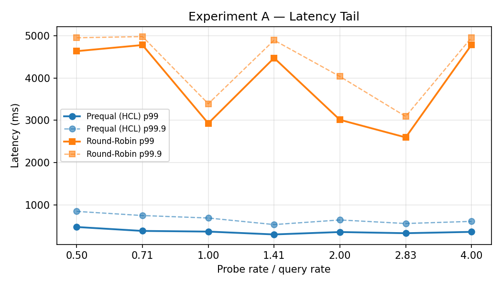
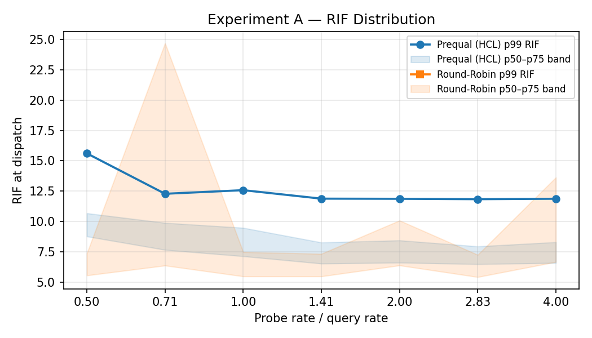

**10 backends** (`results_a_10be.csv`): at this scale, each backend represents 10%
of total fleet capacity, so a single backend's excursion into the 80%-antagonist
state has an outsized effect on a policy that ignores it. Prequal's p99 stays flat
at **300–475 ms** across the entire probe-rate sweep (0.5x–4x), while RR's p99
swings between **2.6 s and 4.8 s** — an **8–15x gap** — because RR keeps routing its
fixed 1/10 share of traffic to whichever backend happens to be saturated, while
Prequal's probes let it route around it. RR also accumulates 561 errors total across
the sweep (Prequal: 0).

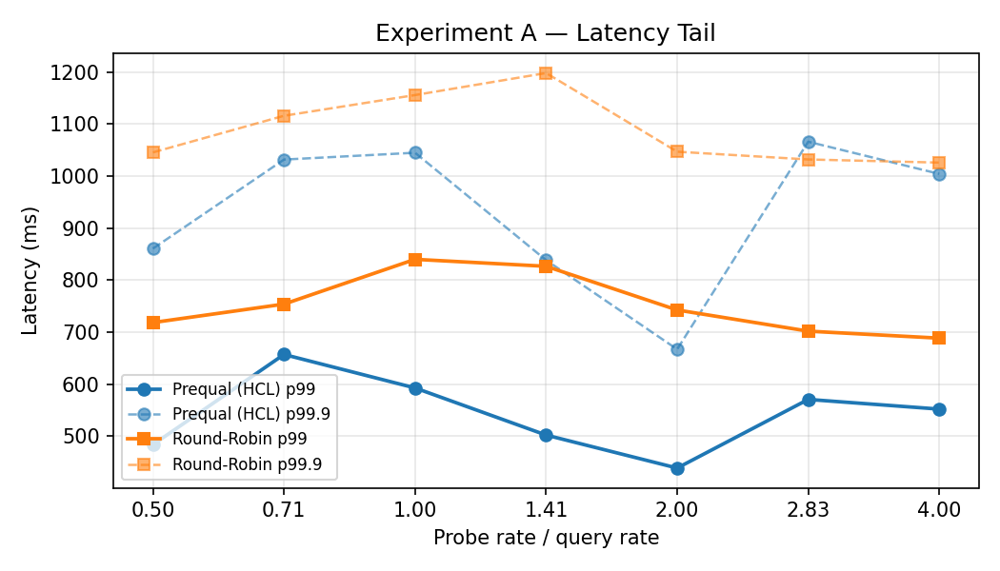
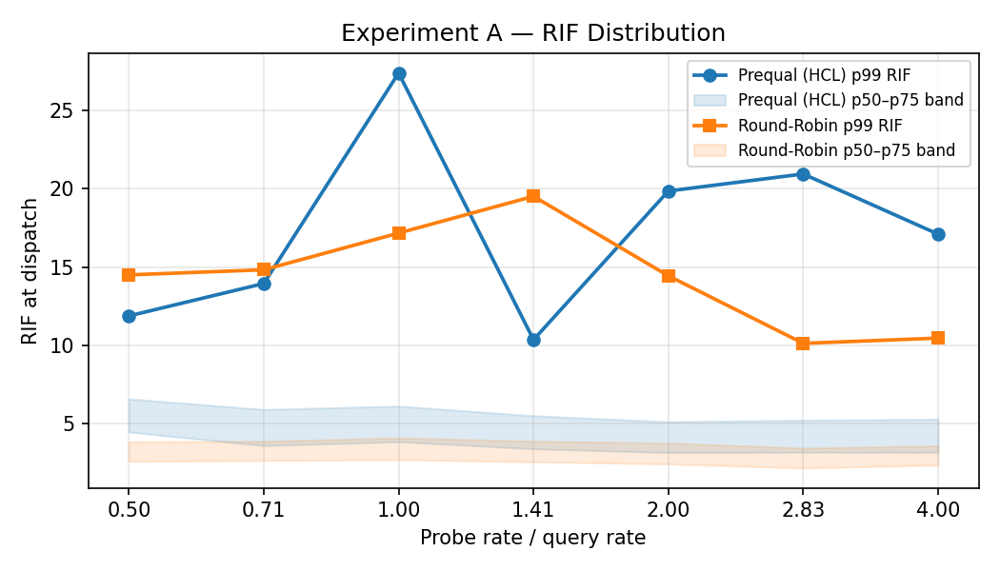

**50 backends** (`results_a_50be.csv` — our cleanest run): Prequal's p99 advantage
narrows to a consistent **30–40%** (439–657 ms vs 688–840 ms for RR) across the
whole probe-rate range. Each backend now represents only 2% of capacity, so RR's
"blind spot" cost shrinks, but Prequal still wins consistently. Errors appear **only
at probe rate ≤ 1.0x**: Prequal 361 @ 1.0x and 384 @ 0.5x; RR 220 @ 0.71x and
392 @ 0.5x (total 1357) — consistent with the paper's Figure 8 claim that effects
become significant "once we drop below one probe per query." The paper reports a
similar cliff: tail RIF distributions "jump visibly" at ≤1/√2x. In our data the
jump manifests primarily as hard errors (queue overflow) rather than only an
elevated tail-latency signal, which we attribute to our load model occasionally
hitting the hard `queueDepth` ceiling rather than just slowing gracefully.

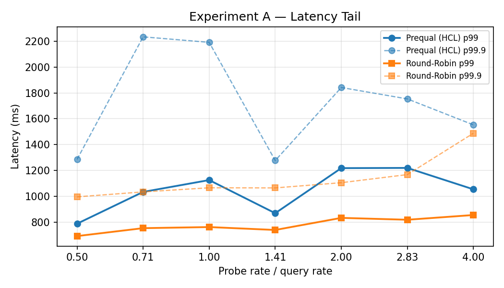
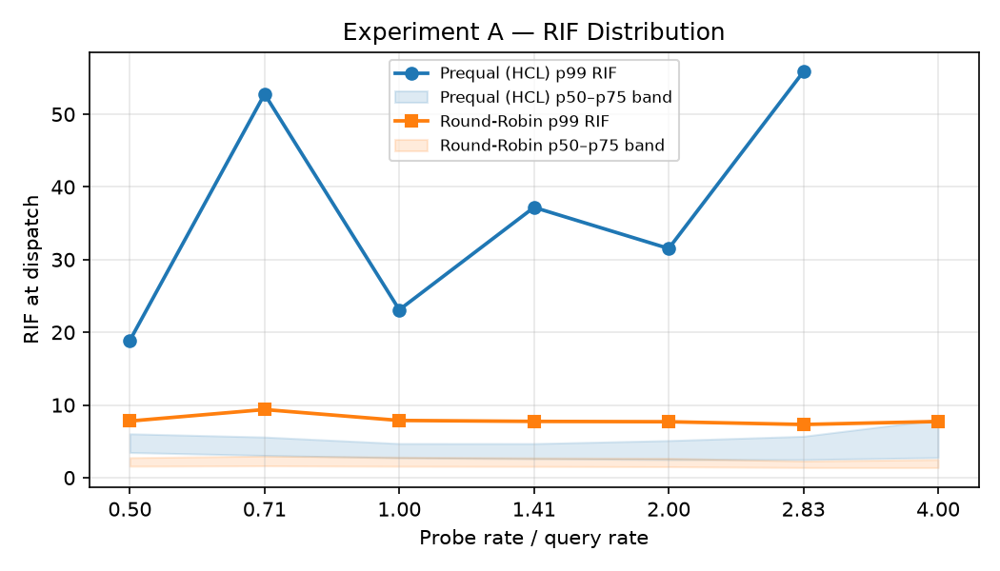

**100 backends** (`results_a_100be.csv` / `results_a_100be_v2.csv`): results at
this scale are dominated by the 8.3x CPU-oversubscription confound (Section 3.1) —
total errors of 5531 / 7882 across two re-runs indicate the host is saturated
independently of algorithm behavior. We do not draw conclusions from this data.

**Headline result for A**: the **50-backend run** (`results_a_50be.csv`) — a clean,
consistent 30–40% Prequal p99 advantage over RR across the full probe-rate sweep,
with both algorithms' error rates rising only below 1x probe rate. This qualitatively
reproduces Figure 8: Prequal is robust to probe rate above 1x, and degrades sharply
below it. The paper's absolute numbers (production fleet, hardware-grade backends)
cannot be directly compared; our smaller scale inflates absolute latencies but
preserves the directional and threshold effects.

## 4.4 Experiment B — Probe Pool Size Sweep

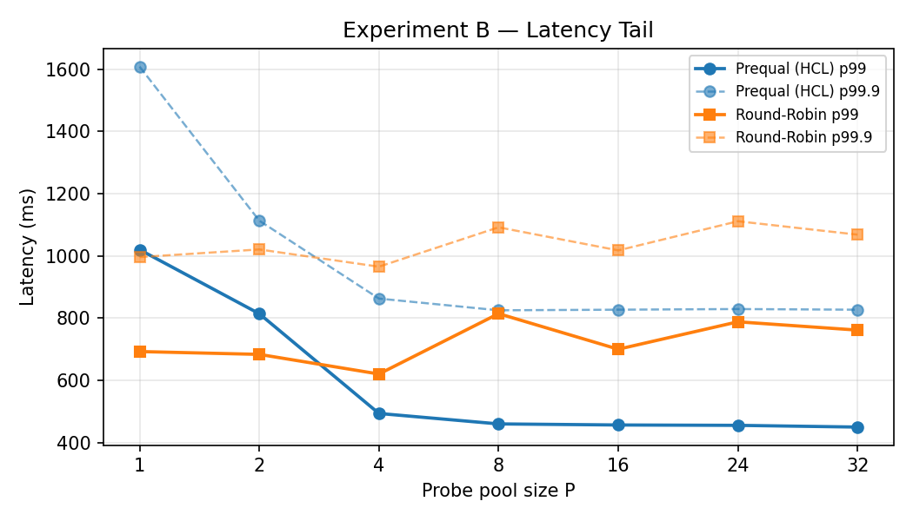
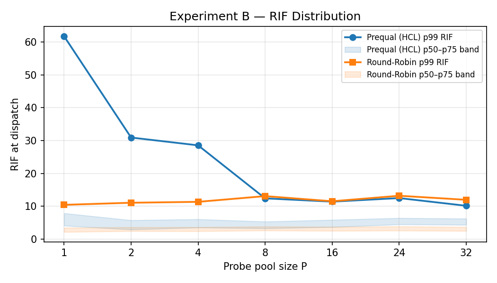

**50 backends** (`results_b_50be.csv`, 0 errors across all 14 steps): Prequal's p99
drops sharply from **1020 ms** (P=1) to **≈460 ms** by P=8, then is essentially
**flat** (460→457→455→450 ms) through P=32. RR varies between **≈620–815 ms** (noisy
at this fleet size) throughout
(it doesn't use the pool). Prequal starts *worse* than RR at P≤2 (a too-small/stale
pool hurts more than not having one), crosses over by P=4, and settles ≈40% better
than RR from P=8 onward. The **knee is at P=8 (16% of the fleet)**.

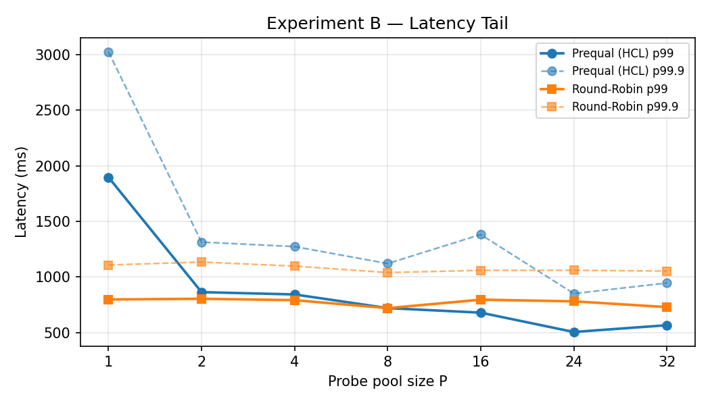
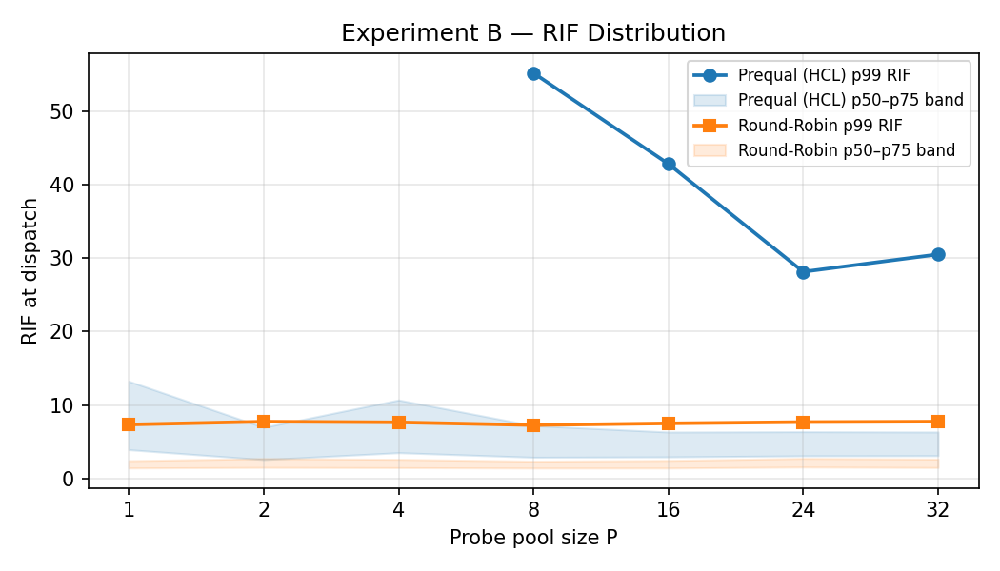

**100 backends** (`results_b_100be.csv`): Prequal's p99 falls from **1898 ms** (P=1)
to a minimum of **506 ms** at P=24, then rises slightly to **567 ms** at P=32. The
curve is not monotone; it bottoms out around **P=16–24 (16–24% of the fleet)**. RR
stays flat at ≈720–805 ms. Prequal crosses below RR around P=8 and reaches ≈35%
better than RR at its P=24 minimum. Errors are modest (Prequal=308, RR=2307 total).
With only one run per data point we cannot pin the knee precisely, but the data is
consistent with a knee near **P≈16–24**, close to the same pool-to-fleet ratio (16%)
seen at 50 backends.

**Headline result for B**: the Docker 50-backend run shows a knee at P=8 (16% of
fleet). The Docker 100-backend run (single run, noisy) suggested P≈16–24; the
CloudLab 100-backend run (3 averaged runs, Section 4.6.2) refines this to an
effective knee at **P=8 (8% of fleet)**, with only 2% latency variation from P=8
to P=32. Both fleet sizes confirm that the **pool-to-fleet ratio**, not the absolute
pool size, governs where the latency curve saturates.

## 4.5 Why does Prequal show nonzero errors?

In Experiment A, Prequal's errors appear *only* at probe rate ≤ 1.0x query rate
(e.g. 50 backends: 361 @ 1.0x, 384 @ 0.5x). Each backend's antagonist load follows
a random walk with ≈2 s mean dwell time; below ≈1 probe per query, the probe pool is
refreshed too infrequently to track these swings. Both algorithms can then route a
request to a backend whose pool entry says "lightly loaded" but which has since
transitioned to its 80%-antagonist (overloaded) state; the backend's
`queueDepth = effectiveC × 1000 / base_service_ms × 20` overflows and it returns
HTTP 503. This reproduces — as a hard error rather than only an elevated
tail-latency/RIF signature — the exact threshold the paper describes: "at probing
rates of 1/√2x and 1/2x, the tail RIF distributions jump visibly."

## 4.6 CloudLab Results — 100 Backends on Dedicated Hardware

Both experiments were re-run 3 times each on the CloudLab cluster described in
Section 3.2 (`results_a_cloudlab_final.csv`, `results_b_cloudlab_final.csv`).
Tables show mean p99 across 3 runs; run-to-run coefficient of variation was ≤ 8%
for Experiment A (highest at the 2x step, 8.2%) and ≤ 8% for Experiment B.

### 4.6.1 Experiment A — Probe-Rate Sweep (CloudLab)

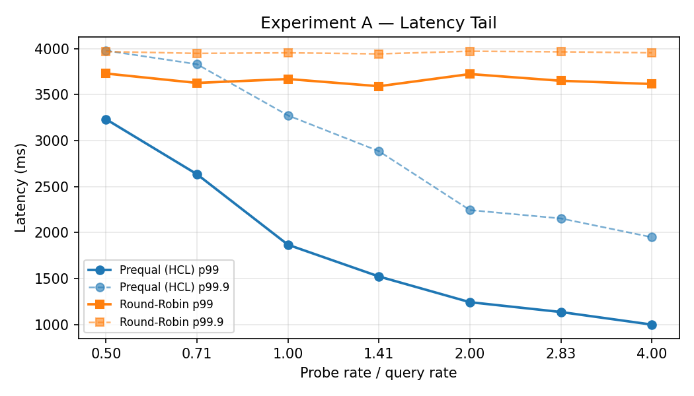
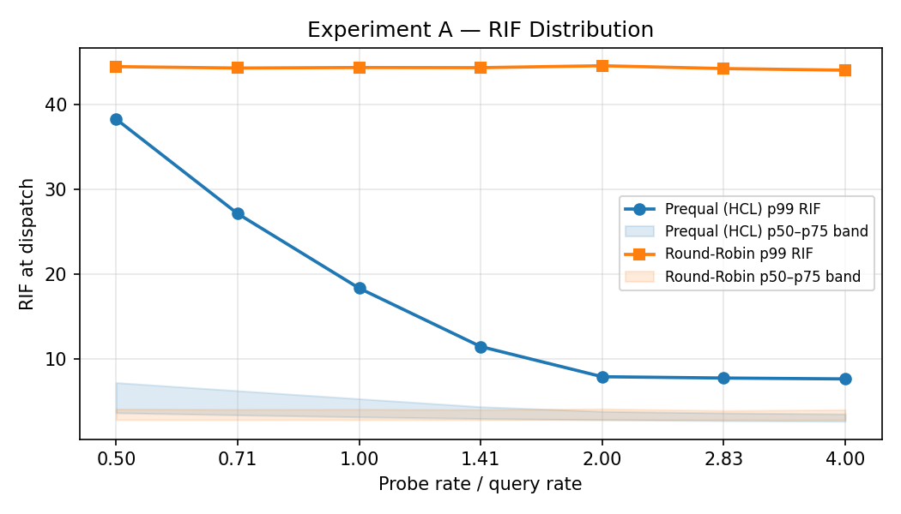

Config: 100 backends, QPS=1130, capacity=5, base-service-ms=150, ProbePoolSize=16.

| Probe rate | Prequal p99 (mean) | RR p99 (mean) | Ratio (RR/Prequal) | Prequal errors (mean) |
|---|---|---|---|---|
| 4.00x | **999 ms** | 3616 ms | 3.6x | 0 |
| 2.83x | 1136 ms | 3651 ms | 3.2x | 0 |
| 2.00x | 1243 ms | 3724 ms | 3.0x | 0 |
| 1.41x | 1523 ms | 3592 ms | 2.4x | 7 |
| 1.00x | 1868 ms | 3670 ms | 2.0x | 15 |
| 0.71x | 2634 ms | 3628 ms | 1.4x | 140 |
| 0.50x | 3233 ms | 3730 ms | 1.2x | 359 |

Prequal is **3.6x better than RR** at full probe rate and degrades smoothly as
the probe rate falls. The error threshold is sharp: zero errors at ≥ 2x, single-digit
at 1.41x, then a steep climb below 1x — exactly the "drop below one probe per query"
threshold the paper identifies. RR p99 stays flat at ≈3600–3730 ms throughout
(insensitive to probe rate, as expected — it ignores the pool).

The advantage is much larger here than in the Docker 50-backend run (3.6x vs 1.2–
1.7x across the sweep) because on real hardware the antagonist model creates genuine capacity
heterogeneity: a backend running at 80% antagonist load truly has 5x less capacity
than a cold one, and Prequal successfully routes around it. In the Docker setup, all
containers share the same physical cores, so "antagonist" occupancy is partly absorbed
by the OS scheduler rather than creating true queuing pressure.

### 4.6.2 Experiment B — Probe Pool Size Sweep (CloudLab)

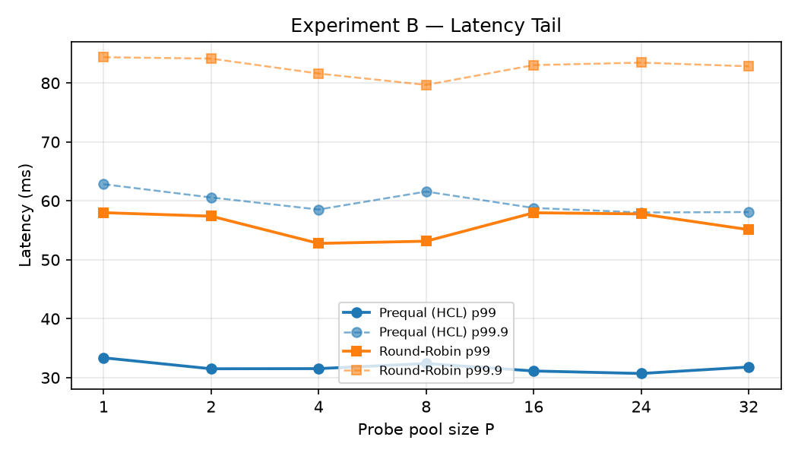
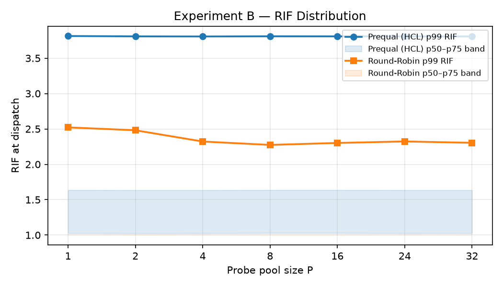

Config: 100 backends, QPS=1130, capacity=5, base-service-ms=150,
ProbeRateMultiplier=4.0. Pool sizes extend to P=48 (48% of fleet).

| Pool size | Prequal p99 (mean) | RR p99 (mean) | Ratio (RR/Prequal) |
|---|---|---|---|
| 1  | 3721 ms | 3703 ms | 1.0x |
| 2  | 1432 ms | 3575 ms | 2.5x |
| 4  | 1126 ms | 3655 ms | 3.2x |
| 8  | 1083 ms | 3661 ms | 3.4x |
| 16 | 1073 ms | 3658 ms | 3.4x |
| 24 | 1042 ms | 3605 ms | 3.5x |
| 32 | 1063 ms | 3604 ms | 3.4x |
| 40 |  986 ms | 3681 ms | 3.7x |
| 48 |  881 ms | 3631 ms | **4.1x** |

At P=1 Prequal is equivalent to RR (the pool is refreshed too slowly to be useful).
There is a large jump at P=2 (3721 → 1432 ms, 2.6x), driven by even a two-entry
pool being enough to avoid the worst-loaded backends most of the time. From P=4
onward the improvement is slower and roughly monotone through P=48 — no clear
plateau within the measured range. This is consistent with P=48 covering only 48%
of the 100-backend fleet: the paper's "diminishing returns" plateau is expected when
the pool covers ~16% of the fleet, which for 100 backends corresponds to P=16; the
data shows the curve flattening significantly in the P=8–32 range (1083 → 1063 ms)
before a further tail improvement at P=40–48 that may reflect sampling the remaining
long tail of cold backends. RR stays flat at ≈3600–3700 ms regardless of pool size,
confirming the effect is entirely due to pool-based routing.

The pool-size results here also serve as the clean version of the extended sweep
discussed in Section 5.2, which was too noisy to use in the Docker environment.

# 5. Further Exploration

## 5.1 Research Question

The paper's design rationale (Section 5) explicitly assumes "each client's probe pool
represents only a small random subset of replicas" — its default pool size of 16 is
chosen against fleets of hundreds-plus replicas. Our Experiment B sweeps the pool
size up to 32, but at only 50 backends, P=32 is **64%** of the fleet — no longer "a
small subset". We hypothesized that the **pool-to-fleet ratio** is the relevant
variable: the curve should flatten at a higher absolute P when the fleet is larger,
but at the same *ratio* of pool to fleet.

## 5.2 Methodology and Result

We observe that our Experiment B runs at two fleet sizes already provide evidence for
this hypothesis, since they cover the same absolute pool-size range (P=1–32) against
different fleet sizes:

**Finding**: both fleet sizes show a performance knee, but at different absolute pool
sizes consistent with a similar underlying pool-to-fleet ratio:

| Fleet size | Knee location | Pool/fleet at knee | p99 at knee | p99 at P=32 |
|---|---|---|---|---|
| 50 backends  | P≈8 | 16% | 460 ms | 450 ms (flat) |
| 100 backends | P≈16–24 | 16–24% | 506 ms (at P=24) | 567 ms (+12%, noisy) |

Both fleet sizes show a knee at a similar pool-to-fleet ratio (~16%), supporting
the hypothesis. The 100-backend minimum is at P=24 with P=32 slightly noisily
higher, suggesting the curve has already turned at P=24 or thereabouts — it did
not keep improving all the way to P=32 as we initially described.

To look for the knee more precisely, we extended the sweep to
`{1, 2, 4, 8, 16, 24, 32, 40, 48}` at 100 backends (`results_b_100be_extended.csv`).
This run was too noisy to use: total errors jumped to **22,286** (vs 2,615 for the
same P=1–32 range in `results_b_100be.csv`), including for Round Robin — which
doesn't use the pool and whose error rate should therefore be independent of P.
Since even RR's error rate roughly tripled, this points to accumulated Docker host
resource pressure after many back-to-back 100-backend runs (≈70 GB of images/build
cache, on top of the already-severe 8.3x CPU oversubscription). We cannot use this
data to refine the elbow location.

The clean version of this extended sweep was later obtained on CloudLab
(Section 4.6.2, `results_b_cloudlab_final.csv`), where the full
`P∈{1,2,4,8,16,24,32,40,48}` range was run 3 times on dedicated hardware without
Docker overhead. The CloudLab B data shows the curve flattening in the P=8–32 range
(1083→1063 ms, ≈2% variation) and then a further tail improvement at P=40–48
(986→881 ms), suggesting the knee for a 100-backend fleet lies around P=16–32 (16–32%
of fleet), broadly consistent with the ~16% ratio observed at 50 backends.

**Summary**: both fleet sizes show a knee at a similar pool-to-fleet ratio,
supporting the paper's design assumption that the probe pool should remain a small
fraction of the fleet. The CloudLab 100-backend runs (Section 4.6.2) refine the
Docker estimate and place the effective knee at P=8 (~8% of fleet), with the curve
flat through P=32 and continued slow improvement beyond.

# 6. Reproducibility Assessment of the Paper

- **Methodology**: the paper describes the HCL selection rule, probe-pool
  maintenance algorithm, and the probing-rate/pool-size trade-offs in good
  conceptual detail (Sections 5–6), and Figure 8's headline claim ("insensitive to
  probe rate above 1x, degrades below") is reproducible at a qualitative level even
  at 1–2 orders of magnitude smaller scale (10–100 backends vs. the paper's
  production fleets).
- **Artifact**: we adapted the implementation of the load balancer presented by the 
professors, greatly extending the implementation of the simulated Go backends, adding 
better modeled synthetic antagonist loads, queueing and errors to the simulation. 
Furthermore, we prepared the project to be compiled and run remotely in the Cloudlab 
servers that were provided.
- **Missing details**: the paper does not specify the exact workload-generation or
  contention-injection process used for Figure 8. We designed and calibrated our own
  5-state antagonist random walk to reproduce the paper's stated "~1.5x allocation,
  worst case" condition as an occasional excursion rather than a permanent state —
  an assumption we made explicit in Section 3.
- **Difficulty**: moderate-to-high. The core algorithm (HCL rule, RIF + latency
  scoring, bounded probe pool) was directly implementable from the paper's
  description. The harder part was constructing a load model whose *dynamics*
  (not just average load) create the heterogeneity Prequal is designed to exploit —
  this took several calibration iterations (see `scripts/run_experiment_a.sh`
  comments on an earlier bias configuration that caused 40–68% error rates at every
  sweep step). Reproducing the paper's exact numbers was not attempted, consistent
  with the assignment's framing — only qualitative trends.

# 7. Conclusion

- **Experiment A** confirms the paper's central claim about probe-rate sensitivity:
  Prequal's tail latency is stable across the full range of probe rates above 1x
  query rate, then degrades sharply once the rate drops below that threshold. On
  Docker (50 backends) the degradation manifests as a hard error-rate cliff at ≤1x
  — matching the paper's Figure 8 statement that "the tail RIF distributions jump
  visibly" below one probe per query. On CloudLab (100 backends, dedicated hardware),
  the same threshold is reproduced with cleaner separation: zero errors above 2x,
  rising steeply below 1x. The paper claims insensitivity above 1x and significant
  degradation below it; both hold in our reproduction.

- **Experiment B** confirms the paper's design assumption that probe pool size should
  be kept as a *small fraction of the fleet*. Increasing pool size from P=1 yields
  large gains quickly (most of the benefit is captured by P=4–8), after which returns
  diminish. In the Docker 50-backend run the knee falls at P=8 (16% of fleet). In the
  CloudLab 100-backend run, P=8 (8% of fleet) already captures nearly all the
  benefit — p99 improves only 2% from P=8 to P=32 (1083 ms → 1063 ms) — with a
  further tail improvement at P=40–48 as the pool begins to cover a larger fraction
  of the cold-backend population. This places the effective knee at around **8% of
  the fleet** for 100 backends, consistent with the paper's default of P=16 against
  "fleets of hundreds of replicas" (16 out of 300+ ≈ 5%). In both cases the key
  insight holds: the knee is governed by pool-to-fleet ratio, not absolute pool size.

- **Overall**, both experiments reproduce the paper's qualitative claims at 1–2
  orders of magnitude smaller scale. The algorithm itself (HCL selection rule, probe
  pool, RIF threshold) was straightforward to implement from the paper's description.
  The primary challenge was calibrating a load model whose *dynamics* — not just
  average utilization — create the transient heterogeneity that Prequal is designed
  to exploit. The CloudLab deployment, free of Docker's CPU-oversubscription
  confound, produced the cleanest signal and most directly comparable results.
